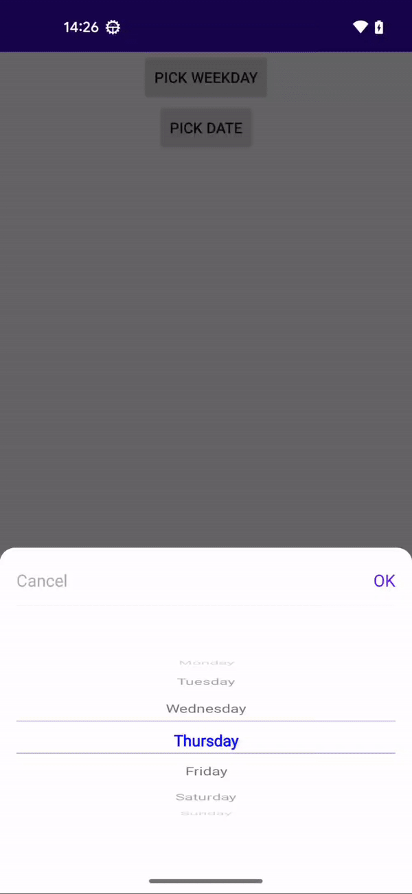

# WheelView

本项目源自：

[Android-PickerView](https://github.com/Bigkoo/Android-PickerView)


简化了代码，用kotlin重新撸了一遍。 特点是轻便，易定制，易魔改。

### [English Readme](https://github.com/jiangnan44/WheelView#readme)

## 效果图




## 怎么用？

把 WheelView 源文件 和 attrs 里面定义的属性copy到你的项目，直接开干。

写了两个示例，一个用普通的DialogFragment，可用于对付天朝各种牛逼射技师和产品；一个用BottomSheetDialogFragment写的，直接禁用了系统的拖拽效果，想保留效果的，自行重写BottomSheetBehavior解决，要搞一堆事，我就不管了

**PickWeekdayDialog**

```kotlin

private var selectWeekday = "Wednesday"
private fun showWeekDialog(view: View?) {

    PickWeekdayDialog()
        .withInitDay(selectWeekday)
        .withWeekdayChooseListener { chosenDay ->
            selectWeekday = chosenDay
            Toast.makeText(this, "picked:$chosenDay", Toast.LENGTH_SHORT).show()
        }
        .show(supportFragmentManager)
}
```

**PickDateDialog** 
```kotlin
    private var selectDate = "2023-5-12"
    private fun showDateDialog(view: View?) {

        PickDateDialog()
            .withYearRang(start = 1990, end = 2030)
            .withInitDate(selectDate)
            .withDateChooseListener { chosenDay ->
                selectDate = chosenDay
                Toast.makeText(this, "picked:$chosenDay", Toast.LENGTH_SHORT).show()
            }
            .show(supportFragmentManager)
    }
```

自定义UI的话，看源码自己简单改改layout里的一些属性即可。


## 支持的属性

```xml
    <declare-styleable name="WheelView">
        <attr name="android:textSize" />
        <attr name="android:lineSpacingMultiplier" />

        <attr name="subTextColor" format="color" />
        <attr name="subTextGradient" format="boolean" />
        <attr name="centerTextColor" format="color" />
        <attr name="centerTextMidWeight" format="boolean" />
        <attr name="dividerColor" format="color" />
        <attr name="dividerVisible" format="boolean" />
        <attr name="canLoop" format="boolean" />
        <attr name="label" format="string" />
        <attr name="contentBias" format="float" />
        <attr name="labelBias" format="float" />
        <!--        should be odd-->
        <attr name="visibleItemCount" format="integer" />
    </declare-styleable>
```

*   textSize:字体大小, 可以用setCenterTextTypeface() 或者 setSubTextTypeface() 改具体的typeface
*   lineSpacingMultiplier:条目之间的间距
*   centerTextColor:中间选中文字的颜色
*   centerTextMidWeight:中间选中文字是否加中粗，默认为true
*   subTextColor:两边其他条目文字的颜色
*   subTextGradient:两边条目是否透明渐变
*   dividerColor:中间条目上下的分隔线颜色
*   dividerVisible:是否使用分隔线，有其他分隔线效果需要的建议直接在layout里加前景，见**PickDateDialog**
*   canLoop:是否可以循环滚动
*   label:中间选中条目后的附加文字，如 年，月，日 km,kg等等
*   contentBias:可用于条目的水平位置调整，默认条目居中
*   labelBias:可用于label水平位置调，默认label居尾对齐
*   visibleItemCount:总共可见条目总数，需要设成奇数
*   subTextXOffset:两边条目X方向偏移


